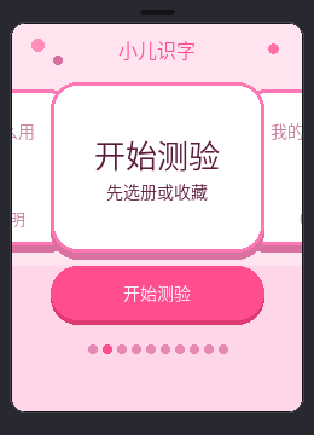
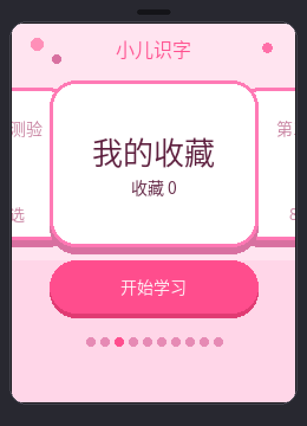
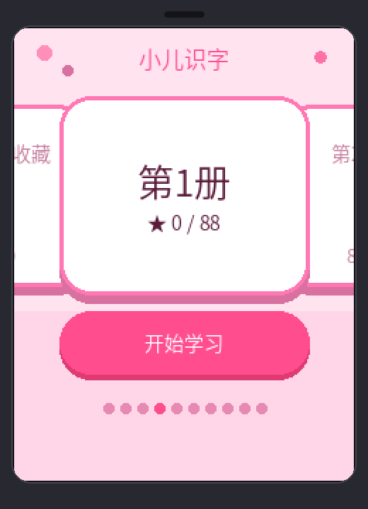
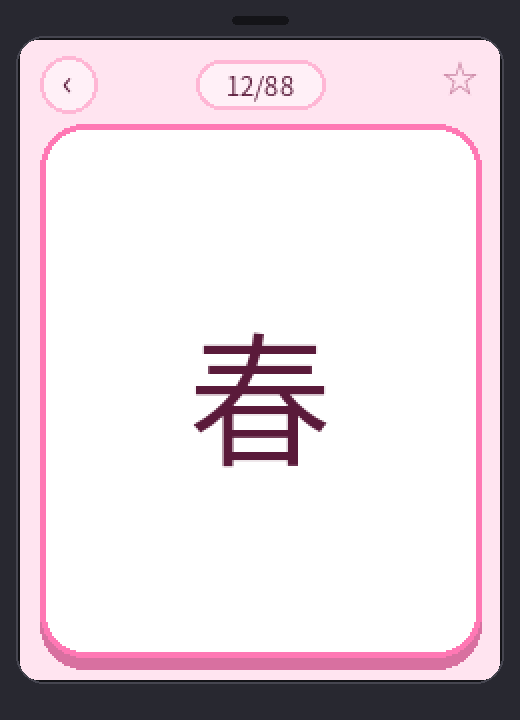
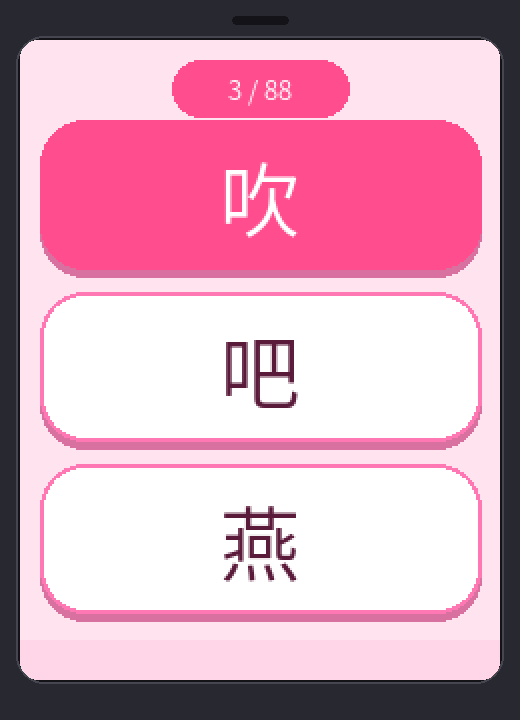
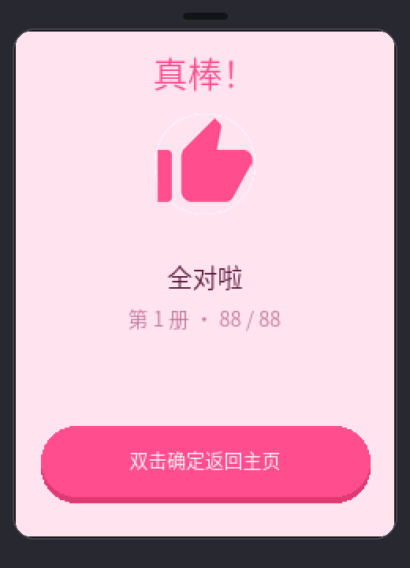
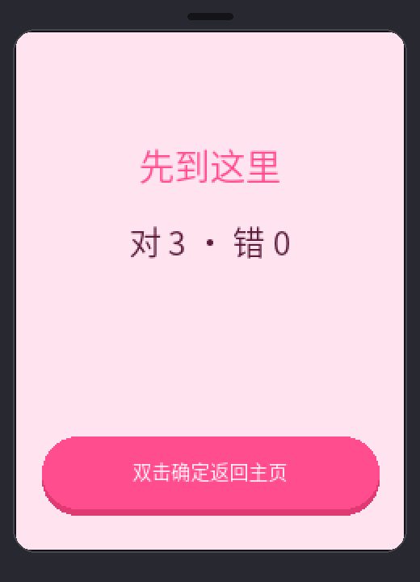

# Xiaoer-Shizi

[简体中文](README.zh_CN.md)

Kids hanzi firmware for the [FoloToy AI Passport](https://github.com/folotoy/ai-passport) (ESP32-C3).

Pink UI, **Siwu Fast Reading books 1–7** (960 slots), offline voice, favorites, and listen-and-pick quizzes. Finished app — not the upstream demo menu.

## Preview

<p align="center">
  
  &nbsp;
  
  &nbsp;
  
</p>
<p align="center">
  
  &nbsp;
  
</p>
<p align="center">
  
  &nbsp;
  
</p>

## Features

- **Home (10 slots):** How to use → Start quiz → Favorites → books 1–7; center titles use a mid ~32px font, grouped with star stats
- **Learn:** ~88px glyphs; short OK = voice; long OK = favorite; double OK = back
- **Quiz:**
  - Pick book/favorites (one line: `Book N · N chars`)
  - Listen-and-pick three options (~48px); selected row is solid pink with white glyph
  - **Wrong answer:** score only the first attempt; re-play the character, reshuffle options, stay until correct, then advance
  - **Results:** early exit shows “先到这里” + correct/wrong counts; finished with mistakes lists them; all-correct shows “真棒!” plus a thumbs-up icon; CTA label is “双击确定返回主页”
- **Volume:** Long Up/Down ±10 (10–100, default 90) in NVS

## Buttons

| Key | Role |
| --- | --- |
| Up/Down short | Move selection |
| Up/Down long | Volume |
| OK short | Primary action |
| OK double | Back one level (from quiz: exit to results) |
| OK long | Favorite (learn only) |

## Build / flash

```bash
./tools/validate.sh --static
./tools/validate.sh --firmware
```

Flash `build/Xiaoer-Shizi-full.bin` at `0x0`.

## Assets

| Path | Role |
| --- | --- |
| `assets/fonts/kids_font_{20,32,48,56}.c` | UI / quiz / learn fonts (`56` ABI name ≈ 88px learn glyphs) |
| `assets/images/thumb_up.{svg,png,c}` | All-correct thumbs-up icon |

## License

MIT via FoloToy AI Passport — see `LICENSE`. Curriculum provenance: `main/data/PROVENANCE.zh_CN.md`.
